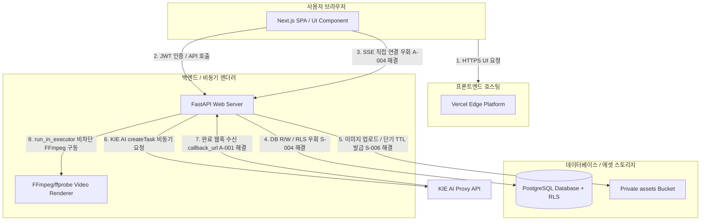

# 🚀 M4 클라우드 인프라 배포 실행 계획서 및 환경 변수 셋팅 가이드

본 문서는 RAPTOR 애플리케이션의 v2.14.0(M4-Cloud) 프로덕션 런칭을 위한 클라우드 인프라(Vercel, Supabase, Koyeb) 배포 파이프라인 구성 및 환경 변수 셋팅 가이드를 규정합니다.

---

## 🛠️ 1. 클라우드 프로덕션 아키텍처 구성도

---

## ⚠️ 2. 배포 필수 3대 전제 조건 상세 가이드

### 1) [전제 조건 1] SUPABASE_SERVICE_ROLE_KEY 설정 (S-004 취약점 방어)
- **목적:** 백엔드 API와 DB 연동 시, Row Level Security (RLS)의 보안 격리를 안전하게 바이패스하여 유기적인 데이터를 통제할 수 있도록 Admin 권한이 확보된 키를 주입합니다. anon key로 오용 시 데이터 쓰기 누락 현상이 일어나는 런타임 결함을 해결합니다.
- **적용처:** **Koyeb (백엔드)** 환경 변수
- **설정 값:** Supabase 대시보드 -> Project Settings -> API -> `service_role` (Secret) 키 값 복사 후 주입.

### 2) [전제 조건 2] assets 버킷 Private 전환 (S-006 에셋 유출 차단)
- **목적:** 유저들이 업로드하는 민감한 원본 상품 이미지 및 결과 비디오 썸네일 경로가 외부에 무분별하게 퍼블릭 URL로 크롤링되거나 노출되는 현상을 차단합니다.
- **적용처:** **Supabase Dashboard (Storage)**
- **설정 방법:**
  1. Supabase 대시보드 왼쪽 메뉴의 `Storage` 진입.
  2. `assets` 버킷 우측의 `...` 버튼 클릭 -> `Edit bucket` 선택.
  3. `Public bucket` 스위치를 **OFF** (비활성화) 처리하고 저장.
  4. 이를 통해 백엔드가 이미지 업로드 후, 클라이언트에게 단기 유효(30분) 서명된 URL(`create_signed_url`)을 통해서만 접근 권한을 수여하게 만듭니다.

### 3) [전제 조건 3] NEXT_PUBLIC_BACKEND_URL 설정 (A-004 Vercel 300초 타임아웃 우회)
- **목적:** Vercel의 Serverless Function 최대 SSE 대기 제한 한도(300초)를 완전히 우회하여, 롱러닝 AI 비디오 생성 작업 도중 클라이언트 연결이 끊어지는 결함을 박멸합니다.
- **적용처:** **Vercel (프론트엔드)** 환경 변수
- **설정 값:** Koyeb에 배포된 백엔드 실서버의 도메인 주소 (예: `https://raptor-backend.koyeb.app`)

---

## 🔑 3. 프로덕션 환경 변수 (Environment Variables) 셋팅 원장

### 🔴 백엔드 인프라 셋팅 (Koyeb Console)

| 환경변수 키 | 프로덕션 권장 값 | 역할 및 설명 |
| :--- | :--- | :--- |
| `SUPABASE_URL` | `https://your-proj.supabase.co` | Supabase API Endpoint |
| `SUPABASE_KEY` | `your-supabase-anon-key` | 클라이언트 인증용 Anon Key |
| `SUPABASE_SERVICE_ROLE_KEY` | `your-supabase-service-role-key` | **[필수]** DB 직접 제어용 Service Role Key (S-004 방어) |
| `SUPABASE_JWT_SECRET` | `your-supabase-jwt-secret-key` | API JWT 서명 검증용 Secret (S-003 방어) |
| `COOKIE_ENCRYPTION_KEY` | `your-32byte-secure-hex-string` | 보안 세션 쿠키 암호화 키 (Fail-Fast 가드 대상) |
| `WEBHOOK_SECRET` | `your-kie-webhook-signing-secret` | KIE AI 웹훅 HMAC-SHA256 검증용 Secret (A-003 방어) |
| `ALLOWED_ORIGINS` | `https://raptor.vercel.app` | **[필수]** 실서비스 Vercel 배포 도메인 주소 (S-005 CORS 방어) |
| `BRAIN_DIR` | `/app/brain` | Koyeb 클라우드 컨테이너 내 로컬 임시 저장공간 절대경로 |
| `PORT` | `8000` | FastAPI uvicorn 포트 번호 |

### 🔵 프론트엔드 인프라 셋팅 (Vercel Console)

| 환경변수 키 | 프로덕션 권장 값 | 역할 및 설명 |
| :--- | :--- | :--- |
| `NEXT_PUBLIC_BACKEND_URL` | `https://raptor-backend.koyeb.app` | **[필수]** SSE 타임아웃 우회용 백엔드 직접 주소 (A-004 우회) |
| `NEXT_PUBLIC_SUPABASE_URL` | `https://your-proj.supabase.co` | 프론트엔드 SDK 연동용 Supabase URL |
| `NEXT_PUBLIC_SUPABASE_ANON_KEY` | `your-supabase-anon-key` | 프론트엔드 SDK 연동용 Anon Key |

---

## 🚀 4. 클라우드 배포 실행 및 검증 절차

### Step 1. Supabase DDL 마이그레이션 실행
- Supabase SQL Editor에서 `backend/db/schema.sql` 내용을 실행하여 `projects`, `tasks`, `user_video_assets` 스키마 및 RLS 정책을 생성합니다.
- `assets` 버킷을 생성하고 **Private** 상태로 설정합니다.

### Step 2. Koyeb 백엔드 배포 (Docker 빌드)
- Koyeb Console에서 `c:\Antigravity Work\RAPTOR` 리포지토리를 연동하여 배포를 기동합니다.
- 빌드 옵션에서 `backend/Dockerfile`을 타겟으로 지정합니다.
- 배포가 완료되면 백엔드 라이브 주소(예: `https://raptor-backend.koyeb.app`)를 확보합니다.

### Step 3. Vercel 프론트엔드 배포
- Vercel Console에 Next.js 프로젝트를 연동하여 빌드합니다.
- 환경 변수 설정 창에 `NEXT_PUBLIC_BACKEND_URL` 값을 Step 2에서 확보한 Koyeb 실서버 도메인으로 설정하여 반영합니다.

### Step 4. 사후 아키텍처 라이브 검증 (E2E)
- 실서버 배포 도메인에서 회원가입 및 JWT 로그인 동작을 테스트합니다.
- 비디오 생성 요청 시 브라우저가 Vercel 엣지를 거치지 않고 Koyeb 백엔드 서버의 `/api/render-stream` SSE 경로로 직접 커넥션을 수립하는지 크롬 개발자 도구 Network 탭을 통해 확인합니다.
- 생성 완료 시 Supabase `assets` 버킷 내 임시 파일이 즉시 멸균 청소(Storage remove)되는지 모니터링합니다.
