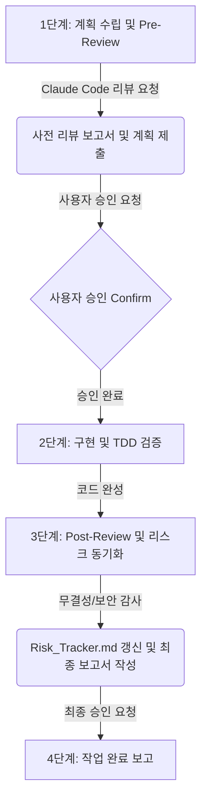

#### 📄 3. _CONVERSATION_SOP_v1.0.md (대화 및 리뷰 표준 운영 절차)

#### 📜 Changelog
*   **v1.1 (Current):** [시스템 강제 명령: 사안별 Claude Code 타겟팅 호출 및 Context Diet 지침] 반영. A모드(지엽적 핫픽스) 및 B모드(아키텍처 대공사) 분기 호출 지침 신설.
*   **v1.0:** 사전/사후 클로드 더블 리뷰(Double Review) 프로세스 및 `Risk_Tracker.md` 동기화 워크플로우를 보장하는 대화 SOP 규정 신설.

---

**1. 개요 및 목적**
본 SOP(Standard Operating Procedure)는 Antigravity와 Claude Code 간의 상호 검증 및 협업 절차를 규정하여, 코드 아키텍처의 무결성과 보안을 강화하고 리스크를 체계적으로 관리하는 것을 목적으로 한다. 모든 개발 작업 시 아래의 4단계 라이프사이클을 준수해야 한다.

---

**2. 4단계 대화 및 리뷰 프로세스 워크플로우**



### 1단계: 계획 수립 및 Pre-Review (사전 리뷰)
1.  **계획 수립:** Antigravity는 사용자 요청 사항을 바탕으로 구현 계획(`implementation_plan.md`)을 수립한다.
2.  **Claude Code 리뷰 트리거:** 계획 수립 직후, 사용자에게 승인을 요청하기 전에 반드시 Claude Code에게 아키텍처 및 계획 검토를 요청한다.
3.  **리스크 교차 검증:** Claude Code의 사전 리뷰 결과를 바탕으로 `Risk_Tracker.md`를 조회 및 분석하여, 아키텍처 상의 리스크나 잠재적 결함을 `[New]` 상태로 등록한다.
4.  **보고 및 승인 획득:** Antigravity는 Claude Code의 사전 리뷰 보고서와 구현 계획을 합쳐 사용자에게 제출하고 최종 승인(Confirm)을 받는다.

### 2단계: 구현 및 TDD 검증 (Cycle of Trust)
1.  **TDD 채점지 배포:** 계획 승인 후 Claude Code는 핵심 검증용 유닛 테스트 코드를 작성하여 배포한다.
2.  **기능 구현 및 검증:** Antigravity는 코드를 작성하며, 로컬 환경에서 Claude Code의 TDD 테스트를 100% 통과시킨다.
3.  **통합 QA 테스트:** 로컬 TDD 통과 직후, Antigravity는 TestSprite MCP를 호출하여 실제 브라우저 환경 통합 렌더링 QA를 수행한다.

### 3단계: Post-Review (사후 리뷰) 및 리스크 동기화
1.  **코드 무결성/보안 감사 트리거:** 코딩 및 패치가 완료되면, Antigravity는 즉시 Claude Code에게 최종 코드의 무결성, 성능 병목, 보안 취약점 감사를 요청한다.
2.  **Risk_Tracker.md 상태 동기화:**
    *   사후 리뷰의 분석 결과를 `Risk_Tracker.md`에 실시간 갱신한다.
    *   해결 완료된 이슈: `[Resolved]`로 상태 변경 및 해결 내역 기술.
    *   미결/추가 분석 필요 이슈: `[Pending]`으로 유지 또는 전환.
    *   새롭게 발견된 보안/구조적 이슈: `[New]`로 추가 등록.

### 4단계: 작업 완료 보고
1.  **최종 보고서 작성:** Claude Code의 사후 리뷰 보고서와 `Risk_Tracker.md` 최신 동기화 현황을 요약한다.
2.  **사용자 보고:** 작성된 최종 보고서와 함께 작업 완료를 사용자에게 공식 보고한다.

---

**3. 예외 및 긴급 패치 규칙**
*   단순 오타 수정, 문서 포맷 변경 등 코드가 수정되지 않거나 영향도가 극히 낮은 작업은 사전 리뷰를 생략할 수 있으나, 사후 리뷰 및 `Risk_Tracker.md` 동기화는 반드시 수행해야 한다.

---

**4. 사안별 Claude Code 타겟팅 호출 및 Context Diet 지침 (VIBE v2.0)**
앞으로 Claude Code에게 업무를 지시하거나 리뷰를 요청할 때는 사안의 규모를 스스로 판단하여 아래 두 가지 모드 중 하나를 엄격히 선택하여 호출하며, 불필요한 전체 코드 로드를 배제하여 문맥 다이어트(Context Diet)를 준수한다.

#### 🟢 A모드: 지엽적 버그 수정 및 단일 로직 핫픽스 (Targeted Mode)
*   **적용 기준:** 지엽적이고 사소한 버그 패치, 단일 소스 파일 내 일부 라인의 핫픽스 시 적용.
*   **지침:** 파일 전체 코드를 다 읽히지 않고, Claude Code의 네이티브 `@` 멘션 기능을 사용하여 수정한 핵심 스니펫(Snippet) 영역만 라인 번호 범위(`#Start-End`)를 지정해 핀셋으로 타겟팅하여 넘겨 검토를 요청한다.
*   **호출 명령어 예시:**
    ```bash
    claude -p "방금 수정한 @src/components/RaptorWorkflow.tsx#1150-1220 라인의 렌더링 상태 관리 로직을 검토하고, Zustand 상태 누수나 예외 처리 누락이 없는지 확인해 줘." --permission-mode dontAsk
    ```

#### 🔴 B모드: 아키텍처 대공사 및 TDD 채점지 작성 (Architecture & TDD Mode)
*   **적용 기준:** 시스템 전체 파이프라인의 핵심 결합 규칙 변경, 통신 규격(Contract) 수정, 새로운 모듈 추가 등 영향 범위가 넓은 아키텍처적 개편 시 적용.
*   **지침:** 단순한 코딩 스타일이나 포맷 지적은 배제하고, 1) 성능 저하 및 메모리 누수, 2) 보안 취약점, 3) 프론트엔드/백엔드 인터페이스 규격 예외 상황에 대비한 방어 로직 검증 및 TDD 기준 설계에 맞추어 종합적인 사후 아키텍처 검토 보고서 작성을 유도한다.
*   **호출 명령어 예시:**
    ```bash
    claude -p "@main.py 와 @src/components/RaptorWorkflow.tsx 간의 KIE 비동기 통신 규격(Contract)이 변경되었다. 1) 안티그래비티의 코딩 스타일 지적은 배제하고, 2) 성능 저하/메모리 누수/보안 결함 위주로 비판적 교차 검증을 수행하며, 3) 프론트엔드가 폴링을 실패할 경우를 대비한 방어 로직(TDD 채점 기준)을 포함하여 사후 리뷰 보고서를 작성해 줘." --permission-mode dontAsk
    ```
